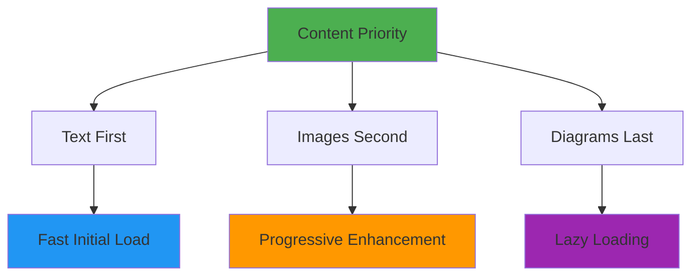

# Performance Guide for Samadeep's Tech Blog

This guide helps maintain optimal performance when creating blog posts with diagrams and rich content.

## 📊 Diagram Performance Guidelines

### Maximum Diagram Recommendations

| Content Type | Max Diagrams | Recommendation |
|--------------|--------------|----------------|
| **Blog Post** | 3-4 diagrams | Split into multiple posts if more needed |
| **Tutorial** | 5-6 diagrams | Use lazy loading (built-in) |
| **Deep Dive** | 2-3 complex diagrams | Prefer simple diagrams over complex ones |

### ✅ Best Practices

#### 1. **Diagram Complexity**
```markdown
<!-- ✅ GOOD: Simple, focused diagram -->

graph TB
    A[Input] --> B[Process]
    B --> C[Output]


<!-- ❌ AVOID: Complex diagram with many nodes -->

graph TB
    A[Input] --> B[Process 1]
    A --> C[Process 2]
    A --> D[Process 3]
    B --> E[Sub-process 1]
    B --> F[Sub-process 2]
    <!-- ... 20+ more nodes -->

```

#### 2. **Diagram Distribution**
- **Spread diagrams throughout the post** rather than clustering them
- **Use text explanations** between diagrams to give browsers time to render
- **Consider splitting complex topics** into multiple posts

#### 3. **Alternative Visualization Methods**

Instead of complex diagrams, use:

```markdown
<!-- Simple ASCII art -->
```
Client → API → Database
   ↓      ↓      ↓
Results ← Processing ← Storage
```

<!-- Tables for comparisons -->
| Feature | Option A | Option B |
|---------|----------|----------|
| Speed   | Fast     | Slow     |
| Memory  | Low      | High     |
```

#### 4. **Performance-Optimized Diagram Types**

**Recommended (Fast Loading):**
- Simple flowcharts (3-8 nodes)
- Basic sequence diagrams (3-4 participants)
- Small class diagrams (2-3 classes)

**Use Sparingly (Heavy Loading):**
- Complex sequence diagrams (5+ participants)
- Large Gantt charts (10+ tasks)
- Network diagrams (10+ nodes)
- Detailed architecture diagrams

## 🚀 Content Performance Tips

### 1. **Image Optimization**
```markdown
<!-- ✅ GOOD: Optimized image -->


<!-- ❌ AVOID: Large uncompressed images -->

```

### 2. **Code Block Optimization**
```markdown
<!-- ✅ GOOD: Focused code snippets -->
```python
def process_data(data):
    return data.transform()
```

<!-- ❌ AVOID: Entire files in code blocks -->
```python
# 500+ lines of code...
```

### 3. **LaTeX/Math Expressions**
```markdown
<!-- ✅ GOOD: Simple math -->
\( E = mc^2 \)

<!-- ❌ AVOID: Complex multi-line equations -->
\[
\begin{align}
\text{Very complex equation}
\end{align}
\]
```

## 🔧 Performance Monitoring

### Built-in Performance Tools

The blog includes built-in performance monitoring:

```javascript
// Automatic performance logging
console.log(`All diagrams loaded in ${totalTime.toFixed(2)}ms`);

// Performance warnings
if (diagramsRendered > 5) {
    console.log('Multiple diagrams detected. Consider splitting content.');
}
```

### Browser DevTools Monitoring

1. **Open DevTools** (F12)
2. **Go to Performance tab**
3. **Record while loading your post**
4. **Look for**:
   - Long tasks (>50ms)
   - Memory usage spikes
   - Layout thrashing

### Performance Budgets

| Metric | Target | Warning | Critical |
|--------|---------|---------|----------|
| **Page Load Time** | < 3s | 3-5s | > 5s |
| **First Contentful Paint** | < 1.5s | 1.5-2.5s | > 2.5s |
| **Diagrams Rendered** | < 4 | 4-6 | > 6 |
| **Memory Usage** | < 100MB | 100-200MB | > 200MB |

## 🛠️ Optimization Techniques

### 1. **Lazy Loading (Automatic)**
All diagrams use lazy loading - they only render when scrolled into view.

### 2. **Diagram Caching**
Rendered diagrams are cached to prevent re-rendering.

### 3. **Progressive Enhancement**
- Content loads first
- Diagrams enhance the experience
- Fallback to text if diagrams fail

### 4. **Content Splitting Strategy**

**Instead of one large post:**
```markdown
# Complete Guide to System Architecture (❌ Too Large)
- 8 diagrams
- 5000+ words
- Multiple complex topics
```

**Split into series:**
```markdown
# System Architecture Series

## Part 1: Basic Concepts (✅ Optimized)
- 2-3 simple diagrams
- 1500 words
- Focused topic

## Part 2: Advanced Patterns (✅ Optimized)
- 2-3 diagrams
- 1500 words
- Focused topic

## Part 3: Implementation (✅ Optimized)
- 2-3 diagrams
- 1500 words
- Focused topic
```

## 🏗️ Architecture Considerations

### Diagram Rendering Pipeline

```
1. Page Load
2. IntersectionObserver Setup
3. Diagram Enters Viewport
4. Lazy Load Trigger
5. Render Diagram
6. Add Interactive Features
7. Performance Logging
```

### Performance-First Architecture



## 📱 Mobile Performance

### Mobile-Specific Optimizations

1. **Simplified Diagrams**: Mobile uses lighter diagram versions
2. **Touch Interactions**: Optimized for mobile gestures
3. **Network Awareness**: Reduces diagram complexity on slow connections

### Mobile Testing
```bash
# Test mobile performance
bundle exec jekyll serve --host 0.0.0.0 --port 4000
# Access from mobile device and test
```

## 🔍 Debugging Performance Issues

### Common Performance Problems

1. **Multiple Complex Diagrams**
   - **Symptom**: Page becomes unresponsive
   - **Solution**: Split content or simplify diagrams

2. **Memory Leaks**
   - **Symptom**: Performance degrades over time
   - **Solution**: Check for proper cleanup in observers

3. **Render Blocking**
   - **Symptom**: White screen during loading
   - **Solution**: Ensure lazy loading is working

### Performance Debugging Checklist

- [ ] Check browser console for performance warnings
- [ ] Verify diagram count is under recommended limits
- [ ] Test on multiple devices and browsers
- [ ] Monitor memory usage in DevTools
- [ ] Check for JavaScript errors
- [ ] Validate lazy loading is working

## 📊 Performance Testing

### Local Testing
```bash
# Start development server
bundle exec jekyll serve --port 4000 --livereload

# Test specific post
open http://localhost:4000/posts/your-post-title/
```

### Performance Metrics Collection
```javascript
// Add to browser console
performance.mark('post-start');
// ... after post loads
performance.mark('post-end');
performance.measure('post-load', 'post-start', 'post-end');
console.log(performance.getEntriesByName('post-load'));
```

## 🎯 Performance Optimization Action Items

### Before Publishing
- [ ] Review diagram count and complexity
- [ ] Test on mobile devices
- [ ] Check browser console for warnings
- [ ] Validate lazy loading functionality
- [ ] Test with slow network conditions

### Content Guidelines
- [ ] Maximum 3-4 diagrams per post
- [ ] Split complex topics into series
- [ ] Use simple diagrams over complex ones
- [ ] Include text alternatives for accessibility

### Technical Monitoring
- [ ] Monitor Core Web Vitals
- [ ] Track diagram rendering times
- [ ] Monitor memory usage patterns
- [ ] Test cross-browser compatibility

## 📚 Additional Resources

- [Web Performance Best Practices](https://web.dev/performance/)
- [Mermaid.js Performance Tips](https://mermaid-js.github.io/mermaid/#/)
- [Jekyll Performance Optimization](https://jekyllrb.com/docs/performance/)

---

*This guide is updated based on real performance issues encountered. Always test your content before publishing!* 