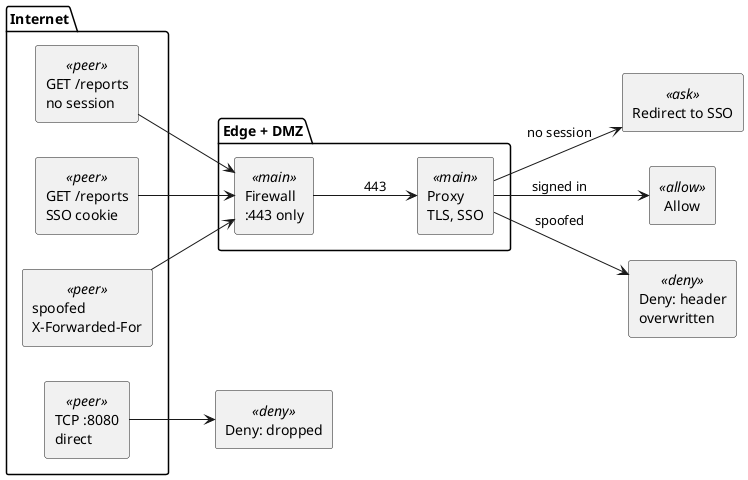

**Short answer:** put the app behind a reverse proxy or an identity-aware access proxy, forward only port 443 through the firewall, allow only flows that came through that forward, and replace "trusted because it's on our network" with SSO and MFA. Then test from *outside*: every bug below passes an inside test.

## The incident

This post started with an incident I kept coming back to: an internal service that had been exposed to the outside, and an external attack that came for it. The road to that kind of incident is usually ordinary: someone needs outside access, a port gets opened, and a service built for "only our people" is reachable by everyone.

So I rebuilt the path in a lab and broke it five ways. **Every output below is from those runs**, and the [lab script](/labs/intranet-to-internet/lab.sh) reproduces them on any Linux machine.

## The mental model that's wrong

```plantuml title="Figure 1: a stateless filter judges every packet. A stateful firewall judges the first one and remembers."
@startuml
package "Stateless (what it's natural to picture)" {
  rectangle "packet 1" <<peer>> as A1
  rectangle "packet 2" <<peer>> as A2
  rectangle "packet 3" <<peer>> as A3
  rectangle "Rules" <<main>> as AR
  rectangle "verdict" <<result>> as AV1
  rectangle "verdict" <<result>> as AV2
  rectangle "verdict" <<result>> as AV3
  A1 -[hidden]right-> A2
  A2 -[hidden]right-> A3
  A1 --> AR : judge
  A2 --> AR : judge
  A3 --> AR : judge
  AR --> AV1
  AR --> AV2
  AR --> AV3
}
package "Stateful (what Linux actually does)" {
  rectangle "packet 1\n(SYN)" <<peer>> as B1
  rectangle "Rules\n+ NAT" <<main>> as BR
  rectangle "Conntrack table\nverdict + rewrite, per flow" <<shared>> as BT
  rectangle "packets 2, 3 ...\nboth directions" <<peer>> as B2
  B1 --> BR : judge once
  BR --> BT : remember
  B2 --> BT : match, rules skipped
}
A3 -[hidden]right-> B1
@enduml
```

The rules run **once per connection**. The verdict and any address rewrite are frozen into a table entry, and every later packet, in both directions, only matches that entry. Nearly every surprise in this post comes from that one difference.

## Networking basics in two minutes

Skip to [the lab](#the-lab) if you know these.

| Term | Meaning | Here |
|---|---|---|
| **Port forwarding (DNAT)** | rewrite the *destination* so traffic to a public address reaches an internal machine | `203.0.113.10:80` becomes `10.0.1.5:8080` |
| **Stateful firewall** | judges the first packet, remembers the decision | `iptables -m conntrack` |
| **Conntrack entry** | the remembered decision, plus a countdown until it's forgotten | one line in `conntrack -L` |
| **Default deny** | anything not allowed is dropped | `iptables -P FORWARD DROP` |

## Where trust moves

```plantuml title="Figure 2: on the intranet, location is the credential. On the internet, identity has to be."
@startuml
package "Before: intranet" {
  rectangle "Employee laptop\n10.20.0.0/16" <<peer>> as L1
  rectangle "App\n10.0.1.5:8080" <<worker>> as A1
  L1 --> A1 : trusted:\nit got here
}
package "After: internet" {
  rectangle "Anyone\n198.51.100.23" <<peer>> as U
  rectangle "Edge\nTLS, rate limits" <<main>> as E
  rectangle "Proxy\nSSO / OIDC" <<main>> as P
  rectangle "App\n10.0.1.5:8080" <<worker>> as A2
  U --> E : :443
  E --> P
  P --> A2 : identity
}
L1 -[hidden]right-> U
@enduml
```

Expose an intranet app and the security it got for free (known network, managed laptops) disappears. Identity has to replace it.

## 3 ways to make an internal app accessible from the internet

| Pattern | Reachable from outside | App changes | Use for |
|---|---|---|---|
| **Identity-aware access proxy** | only the proxy | almost none | internal tools used from home |
| **Reverse proxy in a DMZ** + DNAT | proxy on :443 | client IP, URLs, cookies | partners, customers, public traffic |
| **Outbound tunnel** | nothing inbound | almost none | no public IP, "can't open ports" |

**Rule of thumb: if the audience is still "our people", don't make the app public at all.** Use an access proxy. For real public traffic, the DMZ pattern's edge makes these decisions:



## The lab

```plantuml title="Figure 4: the lab. Each box is a Linux network namespace on one machine."
@startuml
rectangle "client\n198.51.100.23" <<peer>> as C
rectangle "firewall\n203.0.113.10 | 10.0.1.1\nDNAT :80 to 10.0.1.5:8080" <<main>> as F
rectangle "conntrack\ntable" <<shared>> as T
rectangle "app\n10.0.1.5:8080" <<worker>> as A
rectangle "hop\n1200-byte link" <<ask>> as H
rectangle "fw2\nno NAT state" <<deny>> as F2
C --> F : wan
F --> A : dmz
F .right. T
C ..> H : MTU test
A ..> F2 : asymmetric test
@enduml
```

```bash
curl -O https://samadeep.github.io/labs/intranet-to-internet/lab.sh && chmod +x lab.sh
sudo ./lab.sh up      # then: dnat-bug, scan, harden, entry, asym, idle, mtu, down
```

<details>
<summary>The firewall's ruleset (what you'd write on day one)</summary>

```bash
iptables -P FORWARD DROP
iptables -A FORWARD -m conntrack --ctstate ESTABLISHED,RELATED -j ACCEPT
iptables -A FORWARD -m conntrack --ctstate INVALID -j DROP
iptables -t nat -A PREROUTING -i f-wan -d 203.0.113.10 -p tcp --dport 80 \
         -j DNAT --to-destination 10.0.1.5:8080
iptables -A FORWARD -i f-wan -o f-dmz -d 10.0.1.5 -p tcp --dport 8080 \
         -m conntrack --ctstate NEW -j ACCEPT
```
</details>

## One connection, one entry

```text
$ curl -s http://203.0.113.10/          # while conntrack -E watches the firewall
hello from 10.0.1.5
    [NEW] tcp 6 120 SYN_SENT    src=198.51.100.23 dst=203.0.113.10 dport=80 ... src=10.0.1.5 sport=8080 ...
 [UPDATE] tcp 6 432000 ESTABLISHED  ...                                                        [ASSURED]
 [UPDATE] tcp 6 120 TIME_WAIT   ...
```

Each entry holds two address pairs: what the client sent (`dst=203.0.113.10:80`) and what the reply should look like (`src=10.0.1.5:8080`). **The second pair *is* the port forward**: replies are matched and rewritten back automatically. `432000` is the countdown: an established connection is remembered for 5 days by default.

## Finding 1: the port forward that never forwards

```plantuml title="Figure 5: DNAT runs before the filter, so the FORWARD rule must match the internal IP"
@startuml
left to right direction
rectangle "SYN to\n203.0.113.10:80" <<peer>> as P
rectangle "PREROUTING\nDNAT to\n10.0.1.5:8080" <<main>> as N
rectangle "FORWARD\n-d 203.0.113.10\nno match" <<deny>> as B
rectangle "FORWARD\n-d 10.0.1.5\nmatch" <<allow>> as G
P --> N
N --> B : broken rule
N --> G : fixed rule
@enduml
```

```text
# condensed from: sudo ./lab.sh dnat-bug
$ curl -s -m 3 http://203.0.113.10/                         # broken rule
curl: timed out
FORWARD:  0 pkts  ACCEPT ... 203.0.113.10 tcp dpt:80
DNAT:     3 pkts  DNAT   ... 203.0.113.10 tcp dpt:80 to:10.0.1.5:8080
$ curl -s -m 3 http://203.0.113.10/                         # fixed rule
hello from 10.0.1.5
```

**3** packets translated, **0** forwarded: the destination was rewritten *before* filtering, so a rule for the public IP can never match.

> **Lab note:** the climbing DNAT counter reads like "half working". The FORWARD counter is the one that tells the truth.

**Missed by:** the DNAT counter (looks like progress) and default deny (drops silently, so you see a timeout, not a refusal).

## Finding 2: the fix opened a side door

The one that ties back to the incident. With Finding 1's fix in place, an outsider who routes the internal range at the firewall:

```plantuml title="Figure 6: a rule that matches only the destination can't tell the front door from a direct visit"
@startuml
left to right direction
rectangle "attacker" <<peer>> as X
rectangle "203.0.113.10:80\nfront door" <<main>> as D1
rectangle "10.0.1.5:8080\ndirect" <<worker>> as D2
rectangle "A: -d 10.0.1.5\nboth allowed" <<deny>> as A
rectangle "B, C, D:\nfront door only" <<allow>> as B
X --> D1
X --> D2
D1 --> A : allowed
D2 --> A : allowed (bypass)
D1 --> B : allowed
D2 --> B : dropped
@enduml
```

```text
# summary of: sudo ./lab.sh harden
                                             203.0.113.10:80   10.0.1.5:8080 (direct)
A  -d 10.0.1.5            (Finding 1 fix)    open              open    <- bypasses the proxy
B  -m conntrack --ctstate DNAT               open              dropped
C  --ctorigdst 203.0.113.10 --ctorigdstport 80  open           dropped
D  A + drop 10.0.0.0/8 arriving on the WAN   open              dropped
```

**The app answered on its internal address, skipping everything in front of it.** Use B and D together: allow only forwarded flows, and drop private destinations at the edge.

**Missed by:** "internal IPs aren't routable" (not true for your upstream network or provider segment), and scans that only target the public IP.

## Finding 3: replies take a different way home

```plantuml title="Figure 7: the reply skips the firewall holding the entry, so it is never translated back"
@startuml
participant "client" as C
participant "firewall" as F
participant "app" as S
participant "fw2" as F2
C -> F : SYN to 203.0.113.10:80
F -> S : SYN to 10.0.1.5:8080
S -> F2 : SYN-ACK
F2 -> C : SYN-ACK from 10.0.1.5:8080
note over C : wrong sender:\nignored, retried
@enduml
```

```text
# tcpdump on the client, trimmed: sudo ./lab.sh asym
c-wan Out 198.51.100.23.33322 > 203.0.113.10.80: Flags [S]
c-alt In  10.0.1.5.8080 > 198.51.100.23.33322:   Flags [S.]   <- other interface, untranslated
```

**Missed by:** the first firewall (sees only half the flow). **Fix:** symmetric routing, or SNAT inbound + `X-Forwarded-For`.

## Finding 4: quiet connections die, and nobody is told

```plantuml title="Figure 8: the idle timeout evicts the entry; the push is lost and the reset comes from the firewall"
@startuml
participant "client" as C
participant "firewall" as F
participant "app" as S
C -> F : handshake + "hi"
F -> S : (DNAT)
... 5 s idle: entry DESTROYED ...
S ->x F : push at 8 s, retransmitted
C -> F : FIN at 11 s
note over F : no entry: packet is\nfor the firewall itself
F -> C : RST (from the firewall, not the app)
@enduml
```

```text
[DESTROY] tcp 6 ESTABLISHED src=198.51.100.23 dst=203.0.113.10 dport=9000 ... [ASSURED]
client received: nothing; when it finally sent, the connection was reset
client received: pushed after 8s idle                         # with a 2 s TCP keepalive
```

WebSockets, long polls, DB pools and Kafka consumers stall this way behind cloud load balancers and NAT gateways (the lab uses 5 s for minutes).

> **Lab note:** the expected result was silence; the capture showed a reset from the firewall, a box that never ran the app. That's why the app's logs are empty.

**Missed by:** TCP keepalive (Linux default: 2 hours) and the missing RST. **Fix:** heartbeats or keepalive shorter than the shortest idle timeout.

## Finding 5: small pages load, large ones hang

```plantuml title="Figure 9: drop the RELATED 'fragmentation needed' ICMP and path MTU discovery fails"
@startuml
participant "client" as C
participant "hop (1200)" as H
participant "firewall" as F
participant "app" as S
S -> F : 1500-byte segment, DF
F -> H
H -> F : ICMP "need MTU 1200"
F ->x S : ESTABLISHED-only rule drops it
@enduml
```

```text
# summary of: sudo ./lab.sh mtu
ESTABLISHED only:      /      200 20 bytes
                       /big   200 0 bytes   (headers arrived, body hung)
ESTABLISHED,RELATED:   /big   200 200000 bytes
app afterwards:        ip route get 198.51.100.23  ->  mtu 1200
```

> **Lab note:** `200 0 bytes` is what an MTU problem looks like from outside: the server said yes, and the body vanished.

**Missed by:** health checks (small pages), office tests (no small-MTU link), "block ICMP for security". **Fix:** accept `ESTABLISHED,RELATED`.

## What this lab doesn't show

- **Plain HTTP.** TLS changes none of the failures (they're below it).
- **A 5-second Linux idle timeout.** Real cloud middleboxes vary; some send a RST. Check your provider's docs.
- **One kernel.** Separate network stacks and conntrack tables, but no real latency or loss.
- **No application layer.** SSO, header trust and cookies are in the checklist.

## Results

| Failure | What you see | Fix |
|---|---|---|
| FORWARD rule on the public IP | timeout; DNAT counter climbs, FORWARD stays 0 | match the internal IP |
| Side door to the internal IP | nothing, unless you scan the internal address | `--ctstate DNAT` + drop private destinations on the WAN |
| Asymmetric routing | timeouts on some paths | symmetric routing, or SNAT + `X-Forwarded-For` |
| Idle timeout | stalls; a reset from the wrong box | heartbeats below the idle timeout |
| Dropped RELATED ICMP | small pages work, large ones hang | accept `ESTABLISHED,RELATED` |

## Security checklist for an internet-facing internal app

| Intranet assumption | Change |
|---|---|
| "If you can reach me, you're an employee" | SSO with MFA on every route, APIs included |
| plain HTTP is fine | TLS at the edge, HSTS, TLS or mTLS to the app |
| the internal IP is unreachable | allow only forwarded flows; drop private destinations on the WAN |
| `http://reports-host:8080/x` links | relative URLs or a public base URL |
| the source IP is the user | trust `X-Forwarded-For` **only from your proxy** |
| cookies without flags | `Secure`, `HttpOnly`, explicit `SameSite` |
| hidden admin pages | block admin routes at the proxy |

## Step-by-step rollout plan

```text
1  internal users only, via the new proxy      proves proxy + SSO
2  public DNS + SSO, allowlist a few outside IPs   proves the path from outside
3  all authenticated users                      rate limits, logging, alerting
4  remove the old intranet-only access          one path, one ruleset
```

At every stage, **scan from outside: the public address *and* the internal one.**

## Key takeaways

1. **A stateful firewall decides once per flow.** Every finding follows from it.
2. **Location stops being a credential.** Identity at the proxy, first.
3. **Allow the front door, not the destination** (`--ctstate DNAT`).
4. **Failures are silent.** Watch `conntrack -E` and rule counters, not app logs.
5. **Test from where attackers and users are.**

The incident came down to a door that was open when everyone assumed it was closed. Been bitten by a sixth way this breaks? The reply link below goes straight to my inbox.

## References

- [Lab script](/labs/intranet-to-internet/lab.sh): reproduces every output above
- [Netfilter conntrack sysctl defaults](https://docs.kernel.org/networking/nf_conntrack-sysctl.html)
- [iptables-extensions: conntrack match (`--ctstate DNAT`, `--ctorigdst`)](https://ipset.netfilter.org/iptables-extensions.man.html)
- [Azure Load Balancer TCP reset and idle timeout](https://learn.microsoft.com/azure/load-balancer/load-balancer-tcp-reset)
- [RFC 1191: Path MTU Discovery](https://www.rfc-editor.org/rfc/rfc1191)
