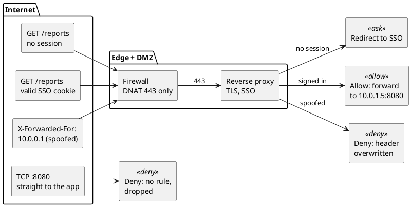

**Short answer:** to expose an intranet application to the internet, put it behind a reverse proxy or an identity-aware access proxy, publish only port 443 through the firewall (DNAT / port forwarding to the proxy, never straight to the app), and replace "trusted because it's on our network" with real authentication: SSO with MFA. Then test from *outside*, because the bugs that matter only show up there.

## Introduction

Most of what I build lives behind a corporate firewall. So when the question "can we just make this reachable from outside?" comes up, it sounds like a networking ticket: open a port, add a forward, done. It isn't, and I wanted to understand exactly why before I ever have to answer it for real.

Inside the office, an intranet app gets half its security for free: every request comes from a known network, behind a firewall, often from a managed laptop. The moment it goes public, that free half disappears, and so do a set of network assumptions nobody wrote down.

To find out exactly what breaks, I rebuilt the path in a lab: a client on the "internet", a stateful Linux firewall doing DNAT, and the app behind it. Then I broke it on purpose in the four ways that show up most often in practice. **Every output in this post is copied from those runs**, and the [lab script](/labs/intranet-to-internet/lab.sh) reproduces all of it on any Linux machine.

## Background: the trust boundary moves

```plantuml title="Figure 1: on the intranet, location is the credential. On the internet, identity has to be."
@startuml
package "Before: intranet" {
  rectangle "Employee laptop\n10.20.0.0/16" as L1
  node "App\n10.0.1.5:8080\nplain HTTP" as A1
  L1 --> A1 : trusted because\nit got here
}
package "After: internet" {
  rectangle "Anyone\n198.51.100.23" as U
  rectangle "Edge\nDNS, TLS, rate limits" as E
  rectangle "Reverse proxy (DMZ)\nSSO / OIDC check" as P
  node "App\n10.0.1.5:8080\nunchanged" as A2
  U --> E : 203.0.113.10:443
  E --> P
  P --> A2 : user identity\n+ X-Forwarded-For
}
L1 -[hidden]right-> U
note bottom of P : trust moves here:\nwho you are,\nnot where you are
@enduml
```

Everything that follows is either moving that boundary (authentication, TLS, headers) or a network detail that breaks while you move it.

## Architecture: three ways to expose an internal app

| Pattern | What's reachable from the internet | App changes | Good for |
|---|---|---|---|
| **Identity-aware access proxy** (zero-trust style) | only the proxy, which authenticates before forwarding | almost none | internal tools used by employees from home |
| **Reverse proxy in a DMZ** + firewall DNAT | the proxy's public IP on port 443 | some: client IP, absolute URLs, cookies | partners, customers, real public traffic |
| **Outbound tunnel** to an edge provider | nothing inbound; the app dials out | almost none | no public IP, carrier-grade NAT, "we can't open ports" |

If the audience is still "our people", don't make the app public at all. Put an access proxy in front and keep the app internal. For everything else there's the DMZ pattern, and Figure 2 shows what its edge has to decide for every request.



## The lab

```plantuml title="Figure 3: lab topology. Each box is a Linux network namespace."
@startuml
rectangle "client\n198.51.100.23" as C
rectangle "firewall\n203.0.113.10 (public)\n10.0.1.1 (DMZ)\nDNAT :80 to 10.0.1.5:8080" as F
node "app\n10.0.1.5:8080" as A
rectangle "fw2\nsecond gateway,\nno NAT state" <<deny>> as F2
rectangle "hop\n1200-byte link\n(a VPN, say)" <<ask>> as H
C --> F : wan
F --> A : dmz
A ..> F2 : asymmetric-routing test
C ..> H : MTU test
@enduml
```

The firewall runs the same ruleset you'd write in production: default-deny forwarding, accept established flows, and one port forward.

```bash
iptables -P FORWARD DROP
iptables -A FORWARD -m conntrack --ctstate ESTABLISHED,RELATED -j ACCEPT
iptables -A FORWARD -m conntrack --ctstate INVALID -j DROP
iptables -t nat -A PREROUTING -i f-wan -d 203.0.113.10 -p tcp --dport 80 \
         -j DNAT --to-destination 10.0.1.5:8080
iptables -A FORWARD -i f-wan -o f-dmz -d 10.0.1.5 -p tcp --dport 8080 \
         -m conntrack --ctstate NEW -j ACCEPT
```

To run it yourself (root on any Linux box; it only touches namespaces it creates):

```bash
curl -O https://samadeep.github.io/labs/intranet-to-internet/lab.sh && chmod +x lab.sh
sudo ./lab.sh up          # then: dnat-bug, entry, asym, idle, mtu, and finally down
```

## How a stateful firewall sees one request

A stateful firewall makes **one decision per flow, not per packet**. The first packet is judged by the rules; the verdict and the address rewrite are frozen into a conntrack entry, and every later packet is matched against that entry instead. Here is one `curl` through the lab firewall, watched with `conntrack -E`:

```text
$ curl -s http://203.0.113.10/
hello from 10.0.1.5
    [NEW] tcp 6 120 SYN_SENT src=198.51.100.23 dst=203.0.113.10 sport=58336 dport=80 [UNREPLIED] src=10.0.1.5 dst=198.51.100.23 sport=8080 dport=58336
 [UPDATE] tcp 6 60 SYN_RECV src=198.51.100.23 dst=203.0.113.10 sport=58336 dport=80 src=10.0.1.5 dst=198.51.100.23 sport=8080 dport=58336
 [UPDATE] tcp 6 432000 ESTABLISHED src=198.51.100.23 dst=203.0.113.10 sport=58336 dport=80 src=10.0.1.5 dst=198.51.100.23 sport=8080 dport=58336 [ASSURED]
 [UPDATE] tcp 6 120 FIN_WAIT ...
 [UPDATE] tcp 6 30 LAST_ACK ...
 [UPDATE] tcp 6 120 TIME_WAIT ...
```

Each line holds two tuples. The first is what the client sent (`dst=203.0.113.10:80`). The second is what the reply is *expected* to look like (`src=10.0.1.5:8080`), and that second tuple is where the DNAT lives: when the app answers, the kernel matches it and rewrites the source back to `203.0.113.10`. The third number is seconds until eviction, and an ESTABLISHED TCP entry gets 432000 seconds (5 days) by default.

Keep that picture in mind. All four failures below are this one mechanism being violated.

## Finding 1: the port forward that never forwards

```plantuml title="Figure 4: DNAT runs before the filter, so the FORWARD rule must match the internal IP"
@startuml
left to right direction
rectangle "SYN\ndst 203.0.113.10:80" as P
rectangle "nat PREROUTING\nDNAT: dst becomes\n10.0.1.5:8080" as N
rectangle "routing\nout via f-dmz" as R
rectangle "FORWARD rule\n-d 203.0.113.10\nno match, DROP" <<deny>> as B
rectangle "FORWARD rule\n-d 10.0.1.5\nmatch, ACCEPT" <<allow>> as G
P --> N
N --> R
R --> B : broken rule
R --> G : fixed rule
@enduml
```

**Symptom:** the port forward is configured, the DNAT counter climbs, and nothing ever connects.

```text
# broken: FORWARD rule matches the public IP
$ curl -s -m 3 http://203.0.113.10/
curl: timed out

$ iptables -L FORWARD -n -v | tail -1
    0     0 ACCEPT  6  --  f-wan  f-dmz  0.0.0.0/0  203.0.113.10  tcp dpt:80 ctstate NEW
$ iptables -t nat -L PREROUTING -n -v | tail -1
    3   180 DNAT    6  --  f-wan  *      0.0.0.0/0  203.0.113.10  tcp dpt:80 to:10.0.1.5:8080

# fixed: FORWARD rule matches the internal IP
$ curl -s -m 3 http://203.0.113.10/
hello from 10.0.1.5
```

The counters tell the whole story: **3 packets** hit the DNAT rule (the SYN and two retries), and **0** hit the FORWARD rule. By the time a packet reaches FORWARD, PREROUTING has already rewritten its destination to `10.0.1.5:8080`, so a rule written for `203.0.113.10:80` can never match.

> **Lab note:** the DNAT counter climbing is the trap. My first instinct was "the rule is half working". It isn't: the counter that tells the truth is the FORWARD one, and it never moved.

**Guards that missed it:** the DNAT rule's counter going up looks like progress. And the default-deny policy drops silently, so the client sees a timeout rather than a refusal.

## Finding 2: replies that take a different way home

```plantuml title="Figure 5: the reply leaves through fw2, which has no conntrack entry, so it is never translated back"
@startuml
participant "client\n198.51.100.23" as C
participant "firewall\n203.0.113.10" as F
participant "app\n10.0.1.5" as S
participant "fw2\nno NAT state" as F2
C -> F : SYN to 203.0.113.10:80
F -> S : SYN to 10.0.1.5:8080 (DNAT)
S -> F2 : SYN-ACK (default route is fw2)
F2 -> C : SYN-ACK from 10.0.1.5:8080
note over C : not the address it called:\nignored, SYN retried
C -> F : SYN (retry)
@enduml
```

**Symptom:** connections time out, but only for some servers or some paths. The lab gives the app a second gateway and points its default route at it. Here is `tcpdump` on the client:

```text
c-wan Out IP 198.51.100.23.33322 > 203.0.113.10.80: Flags [S], seq 2849747145, ...
c-alt In  IP 10.0.1.5.8080 > 198.51.100.23.33322: Flags [S.], seq 3318416431, ack 2849747146, ...
c-wan Out IP 198.51.100.23.33322 > 203.0.113.10.80: Flags [S], seq 2849747145, ...
c-alt In  IP 10.0.1.5.8080 > 198.51.100.23.33322: Flags [S.], seq 3318416431, ack 2849747146, ...
```

The SYN-ACK arrives on a *different interface*, from `10.0.1.5:8080` instead of `203.0.113.10:80`. Only the firewall that saw the SYN holds the entry that would translate the reply back, and the reply never went through it. The client doesn't recognise the sender and keeps retrying.

**Guards that missed it:** the first firewall's rules are correct, because it only ever sees half the flow. A second firewall *with* conntrack would drop the reply as INVALID, which looks like a timeout, not an error.

**Fix:** symmetric routing (the app's route back to the internet goes through the firewall that did the DNAT), or SNAT inbound so replies have to return the same way. SNAT costs you the client's IP, which is why the proxy then has to pass it along in `X-Forwarded-For`.

## Finding 3: quiet connections die, and nobody is told

```plantuml title="Figure 6: the idle timeout evicts the entry; the push is lost and the reset comes from the firewall"
@startuml
participant "client" as C
participant "firewall" as F
participant "app" as S
C -> F : handshake + "hi"
F -> S : (DNAT)
note over F : ESTABLISHED, 5 s idle timeout\n(stands in for a cloud LB's 4 min)
... 5 s of silence ...
note over F : entry DESTROYED
S ->x F : push after 8 s, retransmitted
... client hears nothing ...
C -> F : FIN (client finally speaks)
note over F : no entry, no DNAT:\npacket is for the firewall itself
F -> C : RST, from the firewall, not the app
@enduml
```

**Symptom:** WebSockets, long polls, database pools and Kafka consumers work in the office and silently stall from outside. On the intranet nothing sat in the path to forget the connection. On the internet a load balancer or NAT gateway does, usually after a few minutes of idle (4 minutes by default on an Azure load balancer, 350 seconds on an AWS NAT gateway). The lab shrinks that to 5 seconds:

```text
[UPDATE] tcp 6 5 ESTABLISHED src=198.51.100.23 dst=203.0.113.10 sport=36472 dport=9000 ... [ASSURED]
[DESTROY] tcp 6 ESTABLISHED src=198.51.100.23 dst=203.0.113.10 sport=36472 dport=9000 ... [ASSURED]
client received: nothing; when it finally sent, the connection was reset

# same again, client sends a TCP keepalive every 2 s
client received: pushed after 8s idle
```

The packet capture shows what actually happened. On the DMZ side, the app sent its message at 8 seconds and kept retransmitting it. On the client side, nothing arrived. When the client finally sent its own FIN at 11 seconds, there was no entry to un-DNAT it, so the packet was addressed to the firewall's own IP, and **the firewall's kernel answered with a RST**. The side that was waiting never heard anything, and when the error finally came, it came from a machine that doesn't run the app.

> **Lab note:** I went in expecting silence and got a reset, which sent me back to the packet capture. The reset came from the firewall, a box that never ran the app. If you ever debug a "connection reset" by reading the app's logs, this is why they're empty.

**Guards that missed it:** TCP keepalive exists, but the Linux default fires after 2 hours, far longer than any middlebox waits. And there's no RST at the moment of loss, so nothing logs an error.

**Fix:** application heartbeats (WebSocket pings, SSE comments, Kafka's heartbeat settings) or TCP keepalive, shorter than the shortest idle timeout on the path. In the lab, a 2-second keepalive was enough to keep the entry alive.

## Finding 4: small pages load, large ones hang

```plantuml title="Figure 7: the 'fragmentation needed' ICMP is RELATED traffic; drop it and path MTU discovery fails"
@startuml
participant "client" as C
participant "hop\n1200-byte link" as H
participant "firewall" as F
participant "app" as S
C -> F : GET /big (small packets pass)
S -> F : 1500-byte segment, Don't Fragment
F -> H
H -> F : ICMP "fragmentation needed, MTU 1200"
F ->x S : ESTABLISHED-only rule drops it
note over S : keeps sending 1500 bytes,\nnever learns the smaller MTU
@enduml
```

**Symptom:** the classic "works from the office, hangs from home". Office paths are 1500 bytes end to end. Home paths go through VPNs, tunnels and PPPoE links with smaller MTUs. The lab puts a 1200-byte hop between the client and the firewall:

```text
# firewall forwards ESTABLISHED only (ICMP 'fragmentation needed' is RELATED, so it is dropped)
$ curl -s -o /dev/null -w '%{http_code} %{size_download} bytes\n' http://203.0.113.10/
200 20 bytes
$ curl -s -o /dev/null -w '%{http_code} %{size_download} bytes\n' http://203.0.113.10/big
200 0 bytes
large page: timed out

# firewall forwards ESTABLISHED,RELATED
$ curl -s -o /dev/null -w '%{http_code} %{size_download} bytes\n' http://203.0.113.10/big
200 200000 bytes

$ ip route get 198.51.100.23        # on the app, afterwards
198.51.100.23 via 10.0.1.1 dev a-dmz src 10.0.1.5
    cache expires 599sec mtu 1200
```

The detail worth noticing is `200 0 bytes`: the status line and headers arrived, because they fit in a small packet, and then the body never came. The hop sent back the "fragmentation needed" ICMP message, conntrack classified it as RELATED to the flow, and a rule accepting only ESTABLISHED dropped it. Once RELATED was allowed, the app learned the smaller path MTU (`mtu 1200`) and the 200 KB page loaded.

> **Lab note:** `200 0 bytes` is my favourite line in this post. The server said yes, the status line made it through, and then the body vanished. It's the most honest picture of an MTU problem I've seen.

**Guards that missed it:** health checks fetch small pages. Office testing never crosses a small-MTU link. And "block ICMP for security" sounds responsible.

## What this lab doesn't show

A lab is a model, and this one has edges worth knowing:

- **It's plain HTTP.** TLS changes none of the four failures (they all happen below it), but it does change what you can see in a capture.
- **The idle timeout is 5 seconds, set on a Linux firewall.** Real cloud load balancers and NAT gateways differ: some drop silently like this one, and some can send a RST when the idle timer fires. Check your provider's documentation rather than assuming.
- **Everything runs on one kernel.** Namespaces give each box its own network stack and its own conntrack table, but not real link latency or loss.
- **It doesn't cover the application layer.** SSO, header trust and cookies are in the checklist below, not in the lab.


| Failure | What you see | What's actually happening | Fix |
|---|---|---|---|
| FORWARD rule on the public IP | timeout; DNAT counter climbs, FORWARD counter stays at 0 | DNAT already rewrote the destination before filtering | match the internal IP in FORWARD |
| Asymmetric routing | timeouts on some paths | the reply skips the firewall holding the NAT entry | symmetric routing, or SNAT inbound + `X-Forwarded-For` |
| Idle timeout | stalls; later a reset from the wrong box | the entry was evicted; nobody was told | heartbeats or keepalive shorter than the idle timeout |
| Dropped RELATED ICMP | small responses work, large ones hang | path MTU discovery can't complete | accept `ESTABLISHED,RELATED`; never blanket-drop ICMP |

## The application side: a checklist

The network path is half the work. The other half is everything the app assumed because it lived inside:

| Intranet assumption | Internet reality | Change |
|---|---|---|
| "If you can reach me, you're an employee" | anyone can reach you | SSO (OIDC or SAML) with MFA in front of every route, APIs included |
| plain HTTP is fine inside | traffic crosses networks you don't own | TLS at the edge, HSTS, and TLS or mTLS from proxy to app |
| links like `http://reports-host:8080/x` | those names don't resolve outside | relative URLs, or a configurable public base URL |
| the source IP is the user | the source IP is the proxy | read `X-Forwarded-For`, **but only trust it when the request came from your proxy** |
| cookies with no flags | cross-site and plain-HTTP risks | `Secure`, `HttpOnly`, an explicit `SameSite` |
| admin pages "hidden" by not linking them | scanners find every path | block admin routes at the proxy |
| one DNS name | internal and external clients need different answers | split-horizon DNS |

## Rollout plan

```text
stage 1  internal users only, through the new proxy path   proves the proxy and SSO
stage 2  public DNS + SSO, allowlist a few outside IPs      proves the network path from outside
stage 3  open to all authenticated users                    rate limits, logging, alerting in place
stage 4  remove the old intranet-only access                one path, one set of rules
```

Keep the old path alive until stage 4, so rolling back is a DNS change rather than an incident. And run every stage's tests from **outside** (a phone hotspot is enough), because every failure in this post passes an inside test.

## Key takeaways

1. **Location stops being a credential.** Put identity (SSO plus MFA) at the proxy before anything else.
2. **A stateful firewall decides once per flow.** Port-forward rules, reply routing and idle timeouts all follow from that one fact.
3. **The failures are silent.** Timeouts, stalls and half-loaded pages, rarely a clean error. Watch `conntrack -E` and the rule counters instead of guessing.
4. **Test from where your users are.** Every bug here passed an office test.

## That's the lab

Four failures, one mechanism, and not one of them showed up as a clean error. If you've been bitten by a fifth way this breaks, tell me: I'll add it to the lab and credit you.

## References

- [Lab script for this post](/labs/intranet-to-internet/lab.sh): reproduces every output above
- [Netfilter conntrack sysctl defaults](https://docs.kernel.org/networking/nf_conntrack-sysctl.html), Linux kernel documentation
- [Azure Load Balancer TCP reset and idle timeout](https://learn.microsoft.com/azure/load-balancer/load-balancer-tcp-reset)
- [RFC 1191: Path MTU Discovery](https://www.rfc-editor.org/rfc/rfc1191)
