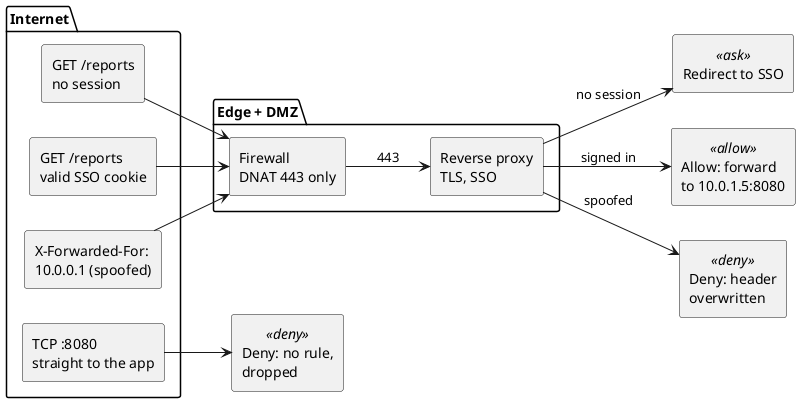

**Short answer:** to expose an intranet application to the internet, put it behind a reverse proxy or an identity-aware access proxy, publish only port 443 through the firewall (DNAT / port forwarding to the proxy, never straight to the app), allow only flows that came through that forward, and replace "trusted because it's on our network" with real authentication: SSO with MFA. Then test from *outside*, because every bug in this post passes an inside test.

## The incident I kept thinking about

This post started with an incident I kept coming back to: an internal service that had been exposed to the outside, and an external attack that came for it. I'm not going to describe it beyond that. What stayed with me wasn't the attack itself but how ordinary the road to that kind of incident usually is: someone needs outside access, a port gets opened, and a service built on the assumption that "only our people can reach this" is suddenly reachable by everyone.

I wanted to understand what actually changes when you make that move, so I rebuilt the path in a lab and broke it on purpose, five different ways. **Every output in this post is copied from those runs**, and the [lab script](/labs/intranet-to-internet/lab.sh) reproduces all of it on any Linux machine.

## The mental model that's wrong

It's natural to picture a firewall as a bouncer checking every packet against the rules. Packet arrives, rules run, allow or drop. Under that model, exposing an app is one rule: allow port 443 in. Done.

**That's not how a stateful firewall works, and nearly every surprise below comes from the difference.** A stateful firewall checks the rules once, for the *first* packet of a connection. It writes the verdict, plus any address rewriting, into a table entry, and every later packet in either direction just matches that entry. The rules never see them.

Once that clicked, the failures stopped looking random.

## Networking basics in two minutes

If you already know NAT and conntrack, skip to [the lab](#the-lab). Otherwise these four ideas carry the rest of the post:

| Term | What it means | In this post |
|---|---|---|
| **Port forwarding (DNAT)** | the firewall rewrites a packet's *destination*: traffic to its public address is sent to an internal machine | `203.0.113.10:80` becomes `10.0.1.5:8080` |
| **Stateful firewall** | judges the first packet of a connection, then remembers the decision | Linux `iptables` with `-m conntrack` |
| **Conntrack entry** | the remembered decision: who talked to whom, how it was rewritten, and a countdown until it's forgotten | one line per connection in `conntrack -L` |
| **Default deny** | anything not explicitly allowed is dropped | `iptables -P FORWARD DROP` |

## The trust boundary moves

```plantuml title="Figure 1: on the intranet, location is the credential. On the internet, identity has to be."
@startuml
package "Before: intranet" {
  rectangle "Employee laptop\n10.20.0.0/16" as L1
  node "App\n10.0.1.5:8080\nplain HTTP" as A1
  L1 --> A1 : trusted because\nit got here
}
package "After: internet" {
  rectangle "Anyone\n198.51.100.23" as U
  rectangle "Edge\nDNS, TLS, rate limits" as E
  rectangle "Reverse proxy (DMZ)\nSSO / OIDC check" as P
  node "App\n10.0.1.5:8080\nunchanged" as A2
  U --> E : 203.0.113.10:443
  E --> P
  P --> A2 : user identity\n+ X-Forwarded-For
}
L1 -[hidden]right-> U
note bottom of P : trust moves here:\nwho you are,\nnot where you are
@enduml
```

An intranet app gets half its security for free: every request comes from a known network, often from a managed laptop. **Expose it, and that free half disappears.** Everything below is either moving the trust boundary (authentication, TLS, headers) or a network detail that breaks while you move it.

## Three ways to make an internal app accessible from the internet

| Pattern | What's reachable from the internet | App changes | Good for |
|---|---|---|---|
| **Identity-aware access proxy** (zero-trust style) | only the proxy, which authenticates before forwarding | almost none | internal tools used by employees from home |
| **Reverse proxy in a DMZ** + firewall DNAT | the proxy's public IP on port 443 | some: client IP, absolute URLs, cookies | partners, customers, real public traffic |
| **Outbound tunnel** to an edge provider | nothing inbound; the app dials out | almost none | no public IP, carrier-grade NAT, "we can't open ports" |

Rule of thumb: **if the audience is still "our people", don't make the app public at all.** Put an access proxy in front and keep the app internal. It removes most of this post from your problem. For real public traffic you need the DMZ pattern, and Figure 2 shows what its edge has to decide for every request.



## The lab

```plantuml title="Figure 3: lab topology. Each box is a Linux network namespace."
@startuml
rectangle "client\n198.51.100.23" as C
rectangle "firewall\n203.0.113.10 (public)\n10.0.1.1 (DMZ)\nDNAT :80 to 10.0.1.5:8080" as F
node "app\n10.0.1.5:8080" as A
rectangle "fw2\nsecond gateway,\nno NAT state" <<deny>> as F2
rectangle "hop\n1200-byte link\n(a VPN, say)" <<ask>> as H
C --> F : wan
F --> A : dmz
A ..> F2 : asymmetric-routing test
C ..> H : MTU test
@enduml
```

Three network namespaces on one Linux box: a client on the "internet", a firewall, and the app. The firewall runs the ruleset you'd write on day one:

```bash
iptables -P FORWARD DROP
iptables -A FORWARD -m conntrack --ctstate ESTABLISHED,RELATED -j ACCEPT
iptables -A FORWARD -m conntrack --ctstate INVALID -j DROP
iptables -t nat -A PREROUTING -i f-wan -d 203.0.113.10 -p tcp --dport 80 \
         -j DNAT --to-destination 10.0.1.5:8080
iptables -A FORWARD -i f-wan -o f-dmz -d 10.0.1.5 -p tcp --dport 8080 \
         -m conntrack --ctstate NEW -j ACCEPT
```

Run it yourself (root on any Linux machine; it only touches the namespaces it creates):

```bash
curl -O https://samadeep.github.io/labs/intranet-to-internet/lab.sh && chmod +x lab.sh
sudo ./lab.sh up      # then: dnat-bug, scan, harden, entry, asym, idle, mtu, and finally down
```

## Watching one connection

Here's the per-flow idea from earlier, made visible. One `curl` through the lab firewall, watched with `conntrack -E`:

```text
$ curl -s http://203.0.113.10/
hello from 10.0.1.5
    [NEW] tcp 6 120 SYN_SENT src=198.51.100.23 dst=203.0.113.10 sport=58336 dport=80 [UNREPLIED] src=10.0.1.5 dst=198.51.100.23 sport=8080 dport=58336
 [UPDATE] tcp 6 60 SYN_RECV src=198.51.100.23 dst=203.0.113.10 sport=58336 dport=80 src=10.0.1.5 dst=198.51.100.23 sport=8080 dport=58336
 [UPDATE] tcp 6 432000 ESTABLISHED src=198.51.100.23 dst=203.0.113.10 sport=58336 dport=80 src=10.0.1.5 dst=198.51.100.23 sport=8080 dport=58336 [ASSURED]
 [UPDATE] tcp 6 120 FIN_WAIT ...
 [UPDATE] tcp 6 30 LAST_ACK ...
 [UPDATE] tcp 6 120 TIME_WAIT ...
```

One entry, six states, one decision. Each line holds two address pairs: what the client sent (`dst=203.0.113.10:80`) and what the reply is *expected* to look like (`src=10.0.1.5:8080`). That second pair is where the port forward lives. When the app answers, the kernel matches the reply and rewrites its source back to `203.0.113.10`; you never write an "un-forward" rule. The number after `tcp 6` is the countdown: an established TCP connection is remembered for 432000 seconds (5 days) by default.

## Finding 1: the port forward that never forwards

```plantuml title="Figure 4: DNAT runs before the filter, so the FORWARD rule must match the internal IP"
@startuml
left to right direction
rectangle "SYN\ndst 203.0.113.10:80" as P
rectangle "nat PREROUTING\nDNAT: dst becomes\n10.0.1.5:8080" as N
rectangle "routing\nout via f-dmz" as R
rectangle "FORWARD rule\n-d 203.0.113.10\nno match, DROP" <<deny>> as B
rectangle "FORWARD rule\n-d 10.0.1.5\nmatch, ACCEPT" <<allow>> as G
P --> N
N --> R
R --> B : broken rule
R --> G : fixed rule
@enduml
```

**Symptom:** the port forward is configured, its counter climbs, and nothing ever connects.

```text
# broken: FORWARD rule matches the public IP
$ curl -s -m 3 http://203.0.113.10/
curl: timed out

$ iptables -L FORWARD -n -v | tail -1
    0     0 ACCEPT  6  --  f-wan  f-dmz  0.0.0.0/0  203.0.113.10  tcp dpt:80 ctstate NEW
$ iptables -t nat -L PREROUTING -n -v | tail -1
    3   180 DNAT    6  --  f-wan  *      0.0.0.0/0  203.0.113.10  tcp dpt:80 to:10.0.1.5:8080

# fixed: FORWARD rule matches the internal IP
$ curl -s -m 3 http://203.0.113.10/
hello from 10.0.1.5
```

**3 packets** hit the DNAT rule (the SYN and two retries), and **0** hit the FORWARD rule. By the time a packet reaches FORWARD, PREROUTING has already rewritten its destination to `10.0.1.5:8080`, so a rule written for `203.0.113.10:80` can never match.

> **Lab note:** the DNAT counter climbing is the trap. It reads like "the rule is half working". It isn't: the counter that tells the truth is the FORWARD one, and it never moved.

**Guards that missed it:** the DNAT counter going up looks like progress, and the default-deny policy drops silently, so the client sees a timeout rather than a refusal.

## Finding 2: the fix opened a side door

This is the one that connects back to the incident. With Finding 1's rule in place, I scanned the firewall the way an outsider would, from an attacker who has guessed the internal range and routes it at the firewall:

```text
$ sudo ./lab.sh harden
# A: FORWARD allows -d 10.0.1.5 (the Finding 1 fix)
  203.0.113.10    port 80    open
  10.0.1.5        port 8080  open
```

**The app answers on its internal address, directly, without going through the port forward at all.** The FORWARD rule allows any new connection *to* `10.0.1.5:8080` arriving on the WAN interface. It can't tell a connection that came through the front door (DNAT) from one that walked straight up to the internal IP. Anything you put in front of the app, like a proxy, SSO or rate limiting, is skipped.

```plantuml title="Figure 5: a FORWARD rule that matches only the destination also allows direct access to the internal IP"
@startuml
left to right direction
rectangle "attacker\n198.51.100.23" as X
rectangle "203.0.113.10:80\n(front door)" as D1
rectangle "10.0.1.5:8080\n(direct)" as D2
rectangle "A: -d 10.0.1.5\nboth allowed" <<deny>> as A
rectangle "B / C / D:\nonly the front\ndoor allowed" <<allow>> as B
X --> D1
X --> D2
D1 --> A : allowed
D2 --> A : allowed (bypass)
D1 --> B : allowed
D2 --> B : dropped
@enduml
```

The lab compares three ways to close it, and all of them keep the front door working:

```text
# B: only flows the firewall itself DNAT'd:  -m conntrack --ctstate DNAT
  203.0.113.10    port 80    open
  10.0.1.5        port 8080  no answer (dropped)

# C: original destination must be the public address:  --ctorigdst 203.0.113.10 --ctorigdstport 80
  203.0.113.10    port 80    open
  10.0.1.5        port 8080  no answer (dropped)

# D: A's rule, plus drop private destinations arriving on the WAN (raw PREROUTING)
  203.0.113.10    port 80    open
  10.0.1.5        port 8080  no answer (dropped)
```

B and D together are the strongest combination: allow only flows that came through the forward, and drop private-range destinations at the edge no matter what other rules say.

**Guards that missed it:** "the internal IP isn't routable on the internet" is true for the public internet, but not for whoever shares your upstream network, your hosting provider's segment, or a misconfigured peer. And the port scan most people run targets the *public* IP, where everything looks fine. The lab's `scan` step checks both addresses, and it's the internal one that gives the game away.

## Finding 3: replies that take a different way home

```plantuml title="Figure 6: the reply leaves through fw2, which has no conntrack entry, so it is never translated back"
@startuml
participant "client\n198.51.100.23" as C
participant "firewall\n203.0.113.10" as F
participant "app\n10.0.1.5" as S
participant "fw2\nno NAT state" as F2
C -> F : SYN to 203.0.113.10:80
F -> S : SYN to 10.0.1.5:8080 (DNAT)
S -> F2 : SYN-ACK (default route is fw2)
F2 -> C : SYN-ACK from 10.0.1.5:8080
note over C : not the address it called:\nignored, SYN retried
C -> F : SYN (retry)
@enduml
```

**Symptom:** connections time out, but only for some servers or some paths. The lab gives the app a second gateway and points its default route at it. Here's `tcpdump` on the client:

```text
c-wan Out IP 198.51.100.23.33322 > 203.0.113.10.80: Flags [S], seq 2849747145, ...
c-alt In  IP 10.0.1.5.8080 > 198.51.100.23.33322: Flags [S.], seq 3318416431, ack 2849747146, ...
c-wan Out IP 198.51.100.23.33322 > 203.0.113.10.80: Flags [S], seq 2849747145, ...
c-alt In  IP 10.0.1.5.8080 > 198.51.100.23.33322: Flags [S.], seq 3318416431, ack 2849747146, ...
```

The reply arrives on a *different interface*, from `10.0.1.5:8080` instead of `203.0.113.10:80`. Only the firewall that saw the SYN holds the entry that would translate the reply back, and the reply never went through it.

**Guards that missed it:** the first firewall's rules are correct, because it only ever sees half the flow. A second firewall *with* conntrack would drop the reply as INVALID, which looks like a timeout, not an error.

**Fix:** symmetric routing, or SNAT inbound so replies have to return the same way. SNAT costs you the client's IP, which is why the proxy then passes it along in `X-Forwarded-For`.

## Finding 4: quiet connections die, and nobody is told

```plantuml title="Figure 7: the idle timeout evicts the entry; the push is lost and the reset comes from the firewall"
@startuml
participant "client" as C
participant "firewall" as F
participant "app" as S
C -> F : handshake + "hi"
F -> S : (DNAT)
note over F : ESTABLISHED, 5 s idle timeout\n(stands in for a cloud LB's 4 min)
... 5 s of silence ...
note over F : entry DESTROYED
S ->x F : push after 8 s, retransmitted
... client hears nothing ...
C -> F : FIN (client finally speaks)
note over F : no entry, no DNAT:\npacket is for the firewall itself
F -> C : RST, from the firewall, not the app
@enduml
```

**Symptom:** WebSockets, long polls, database pools and Kafka consumers work in the office and silently stall from outside. On the intranet nothing sat in the path to forget the connection. On the internet a load balancer or NAT gateway does, usually after a few minutes of idle. The lab shrinks that to 5 seconds:

```text
[UPDATE] tcp 6 5 ESTABLISHED src=198.51.100.23 dst=203.0.113.10 sport=36472 dport=9000 ... [ASSURED]
[DESTROY] tcp 6 ESTABLISHED src=198.51.100.23 dst=203.0.113.10 sport=36472 dport=9000 ... [ASSURED]
client received: nothing; when it finally sent, the connection was reset

# same again, client sends a TCP keepalive every 2 s
client received: pushed after 8s idle
```

The packet capture explains it. The app sent its message at 8 seconds and kept retransmitting it, and nothing reached the client. When the client finally sent its own FIN at 11 seconds, there was no entry to translate it, so the packet was addressed to the firewall's own IP, and **the firewall's kernel answered with a RST**.

> **Lab note:** the expected result was silence; the packet capture showed a reset instead. It came from the firewall, a box that never ran the app. If you ever debug a "connection reset" by reading the app's logs, this is why they're empty.

**Guards that missed it:** TCP keepalive exists, but the Linux default fires after 2 hours, far longer than any middlebox waits. And there's no RST at the moment of loss, so nothing logs an error.

**Fix:** application heartbeats (WebSocket pings, SSE comments, Kafka's heartbeat settings) or TCP keepalive, shorter than the shortest idle timeout on the path. In the lab, a 2-second keepalive kept the entry alive.

## Finding 5: small pages load, large ones hang

```plantuml title="Figure 8: the 'fragmentation needed' ICMP is RELATED traffic; drop it and path MTU discovery fails"
@startuml
participant "client" as C
participant "hop\n1200-byte link" as H
participant "firewall" as F
participant "app" as S
C -> F : GET /big (small packets pass)
S -> F : 1500-byte segment, Don't Fragment
F -> H
H -> F : ICMP "fragmentation needed, MTU 1200"
F ->x S : ESTABLISHED-only rule drops it
note over S : keeps sending 1500 bytes,\nnever learns the smaller MTU
@enduml
```

**Symptom:** the classic "works from the office, hangs from home". Office paths are 1500 bytes end to end; home paths go through VPNs and tunnels with smaller MTUs. The lab puts a 1200-byte hop between the client and the firewall:

```text
# firewall forwards ESTABLISHED only (ICMP 'fragmentation needed' is RELATED, so it is dropped)
$ curl -s -o /dev/null -w '%{http_code} %{size_download} bytes\n' http://203.0.113.10/
200 20 bytes
$ curl -s -o /dev/null -w '%{http_code} %{size_download} bytes\n' http://203.0.113.10/big
200 0 bytes
large page: timed out

# firewall forwards ESTABLISHED,RELATED
$ curl -s -o /dev/null -w '%{http_code} %{size_download} bytes\n' http://203.0.113.10/big
200 200000 bytes

$ ip route get 198.51.100.23        # on the app, afterwards
198.51.100.23 via 10.0.1.1 dev a-dmz src 10.0.1.5
    cache expires 599sec mtu 1200
```

The status line and headers arrived, because they fit in a small packet, and then the body never came. The hop sent back the "fragmentation needed" message, conntrack classified it as RELATED to the flow, and a rule accepting only ESTABLISHED dropped it. Once RELATED was allowed, the app learned the smaller path MTU (`mtu 1200`) and the 200 KB page loaded.

> **Lab note:** `200 0 bytes` is the line to remember. The server said yes, the status line made it through, and then the body vanished. That is what an MTU problem looks like from the outside.

**Guards that missed it:** health checks fetch small pages, office testing never crosses a small-MTU link, and "block ICMP for security" sounds responsible.

## What this lab doesn't show

A lab is a model, and this one has edges worth knowing:

- **It's plain HTTP.** TLS changes none of the five failures (they all happen below it), but it does change what you can see in a capture.
- **The idle timeout is 5 seconds, set on a Linux firewall.** Real cloud load balancers and NAT gateways differ: some drop silently like this one, and some can send a RST when the idle timer fires. Check your provider's documentation rather than assuming.
- **Everything runs on one kernel.** Namespaces give each box its own network stack and its own conntrack table, but not real link latency or loss.
- **It doesn't cover the application layer.** SSO, header trust and cookies are in the checklist below, not in the lab.

## Results

| Failure | What you see | What's actually happening | Fix |
|---|---|---|---|
| FORWARD rule on the public IP | timeout; DNAT counter climbs, FORWARD counter stays at 0 | DNAT already rewrote the destination before filtering | match the internal IP in FORWARD |
| Side door to the internal IP | nothing, unless you scan the internal address | the FORWARD rule can't tell forwarded flows from direct ones | `--ctstate DNAT`, and drop private destinations on the WAN |
| Asymmetric routing | timeouts on some paths | the reply skips the firewall holding the NAT entry | symmetric routing, or SNAT inbound + `X-Forwarded-For` |
| Idle timeout | stalls; later a reset from the wrong box | the entry was evicted, and nobody was told | heartbeats or keepalive shorter than the idle timeout |
| Dropped RELATED ICMP | small responses work, large ones hang | path MTU discovery can't complete | accept `ESTABLISHED,RELATED`; never blanket-drop ICMP |

## Security checklist for an internet-facing internal app

The network path is half the work. The other half is everything the app assumed because it lived inside:

| Intranet assumption | Internet reality | Change |
|---|---|---|
| "If you can reach me, you're an employee" | anyone can reach you | SSO (OIDC or SAML) with MFA in front of every route, APIs included |
| plain HTTP is fine inside | traffic crosses networks you don't own | TLS at the edge, HSTS, and TLS or mTLS from proxy to app |
| the internal IP is unreachable from outside | someone on your upstream network can route to it | allow only forwarded flows; drop private destinations on the WAN |
| links like `http://reports-host:8080/x` | those names don't resolve outside | relative URLs, or a configurable public base URL |
| the source IP is the user | the source IP is the proxy | read `X-Forwarded-For`, **but only trust it when the request came from your proxy** |
| cookies with no flags | cross-site and plain-HTTP risks | `Secure`, `HttpOnly`, an explicit `SameSite` |
| admin pages "hidden" by not linking them | scanners find every path | block admin routes at the proxy |

## Step-by-step rollout plan

```text
stage 1  internal users only, through the new proxy path   proves the proxy and SSO
stage 2  public DNS + SSO, allowlist a few outside IPs      proves the network path from outside
stage 3  open to all authenticated users                    rate limits, logging, alerting in place
stage 4  remove the old intranet-only access                one path, one set of rules
```

Keep the old path alive until stage 4, so rolling back is a DNS change rather than an incident. And at every stage, **scan from outside**, against the public address *and* the internal one.

## Key takeaways

1. **A stateful firewall decides once per flow.** Port-forward rules, side doors, reply routing and idle timeouts all follow from that one fact.
2. **Location stops being a credential.** Put identity (SSO plus MFA) at the proxy before anything else.
3. **Allow the front door, not the destination.** Match forwarded flows (`--ctstate DNAT`), not just the internal IP.
4. **The failures are silent.** Timeouts, stalls and half-loaded pages, rarely a clean error. Watch `conntrack -E` and the rule counters instead of guessing.
5. **Test from where your attackers and users are.** Every bug here passed an inside test.

## That's the lab

The incident I started with came down to a door that was open when everyone assumed it was closed. Five failures, one mechanism, and not one of them showed up as a clean error. Been bitten by a sixth way this breaks? The reply link below goes straight to my inbox.

## References

- [Lab script for this post](/labs/intranet-to-internet/lab.sh): reproduces every output above
- [Netfilter conntrack sysctl defaults](https://docs.kernel.org/networking/nf_conntrack-sysctl.html), Linux kernel documentation
- [iptables-extensions: the conntrack match (`--ctstate DNAT`, `--ctorigdst`)](https://ipset.netfilter.org/iptables-extensions.man.html)
- [Azure Load Balancer TCP reset and idle timeout](https://learn.microsoft.com/azure/load-balancer/load-balancer-tcp-reset)
- [RFC 1191: Path MTU Discovery](https://www.rfc-editor.org/rfc/rfc1191)
