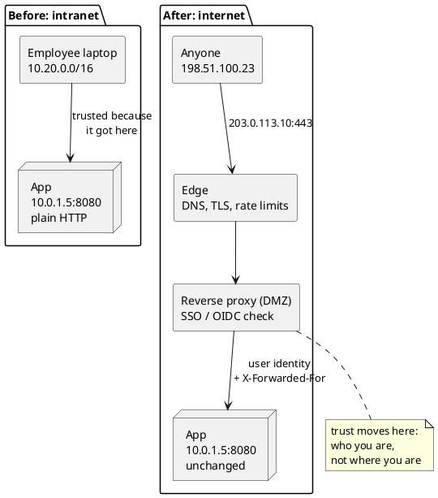
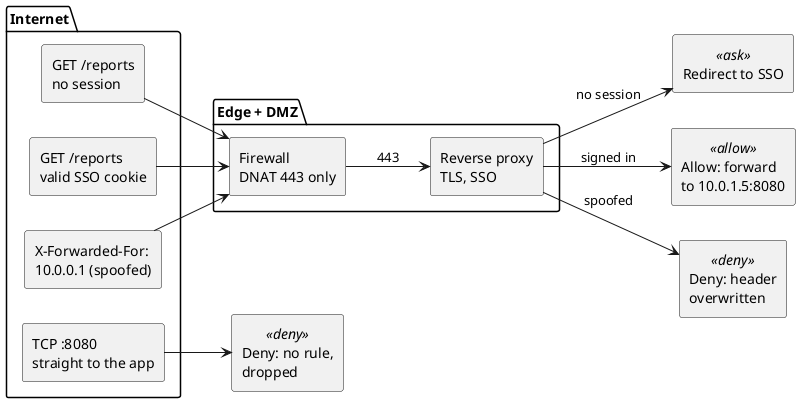

**Short answer:** to expose an intranet application to the internet, put it behind a reverse proxy or an identity-aware access proxy, publish only port 443 through the firewall (DNAT / port forwarding to the proxy, never straight to the app), and replace "trusted because it's on our network" with real authentication (SSO with MFA). Then fix the things that only break from outside: MTU, client IPs behind the proxy, idle timeouts, and hardcoded internal hostnames.

An intranet app gets a lot for free. Every request comes from a known network, behind a firewall, often from a managed laptop. Half its security is "you can only reach me if you're inside." Move it to the internet and that free half disappears.

The one rule this whole post hangs on: **on the intranet, the network is the auth boundary; on the internet, identity has to be.** Everything below is either moving that boundary or a networking detail that breaks while you move it.



## 3 ways to make an internal app accessible from the internet

There are three ways to put an internal app in front of outside users. They differ in what's reachable from the internet and how much of the app has to change.

| Pattern | What's exposed | App changes | Good for |
|---|---|---|---|
| **Identity-aware access proxy** (zero-trust style) | only the proxy; it authenticates before forwarding | almost none | internal tools that employees use from home |
| **Reverse proxy in a DMZ** + firewall DNAT | the proxy's public IP and port 443 | some: real client IP, absolute URLs, cookies | partners or customers, real public traffic |
| **Outbound tunnel** to an edge provider | nothing inbound; the app dials out | almost none | no public IP, CGNAT, or "we can't open ports" |

A rule of thumb: if the audience is still "our people", don't make the app public. Put an access proxy in front, keep the app internal, and you avoid most of what follows. The rest of this post covers the DMZ case, because that's where the networking matters.



## How port forwarding (DNAT) reaches the app

The classic setup: a public IP on the firewall, DNAT to the reverse proxy, which talks to the app.

```bash
# default deny, then let established flows through
iptables -P FORWARD DROP
iptables -A FORWARD -m conntrack --ctstate ESTABLISHED,RELATED -j ACCEPT
iptables -A FORWARD -m conntrack --ctstate INVALID -j DROP

# publish 203.0.113.10:443 as the reverse proxy at 10.0.1.5:443
iptables -t nat -A PREROUTING -i wan0 -d 203.0.113.10 -p tcp --dport 443 \
         -j DNAT --to-destination 10.0.1.5:443
iptables -A FORWARD -i wan0 -o dmz0 -d 10.0.1.5 -p tcp --dport 443 \
         -m conntrack --ctstate NEW -j ACCEPT
```

Two things make this work, and both are easy to get wrong.

**1. The filter rule matches the internal IP.** DNAT runs in PREROUTING, before routing and filtering, so by the time the FORWARD chain sees the packet, its destination is already `10.0.1.5`. Writing the FORWARD rule against `203.0.113.10` is the most common "my port forward doesn't work" bug.

**2. The firewall decides once per flow, not per packet.** The first packet is judged by the rules, and the verdict plus the address rewrite gets frozen into a conntrack entry:

```text
tcp 6 431987 ESTABLISHED
  src=198.51.100.23 dst=203.0.113.10  sport=51544 dport=443   ← ORIGINAL: what the client sent
  src=10.0.1.5      dst=198.51.100.23 sport=443   dport=51544 ← REPLY: what the answer will look like
  [ASSURED] mark=0 use=1
```

Replies match the REPLY tuple and get their source rewritten back to `203.0.113.10` automatically. You never write an "un-DNAT" rule. The `431987` is the seconds left before the entry is evicted (the TCP established default is 432000, 5 days).

That one idea, a decision frozen per flow, explains most of the failures you'll meet during the move.

## Common problems after exposing an intranet app

### Works on the office network, hangs from outside

```text
office:   laptop ─────────────────────────► app            MTU 1500 the whole way
outside:  laptop ─► home router ─► VPN/tunnel ─► firewall ─► app
          large response ─► needs fragmenting  -X-  "fragmentation needed" ICMP dropped
          small pages load, large ones hang forever
```

Guards that missed it:

- **Testing from inside.** The office path never needed path MTU discovery.
- **The firewall policy.** It allowed the TCP flow but dropped ICMP, so the "fragmentation needed" message, which conntrack would have classed as RELATED to that flow, never arrived.

Fix: accept `RELATED` traffic (the rule above does), and never blanket-drop ICMP.

### Every user shows up with the proxy's IP

```text
client 198.51.100.23 ─► proxy SNATs ─► app sees src=10.0.1.20 for everyone
                                    -X- rate limiter bans 10.0.1.20, everyone locked out
                                    -X- audit log: every login "from" the proxy
```

Proxies and SNAT replace the client's IP. That's often deliberate, because it forces replies back through the same box (see asymmetric routing below). The real IP then travels in `X-Forwarded-For`.

Guards that missed it:

- **The app's IP allowlist.** It was written for the intranet and now sees only the proxy, so it either allows everything or nothing.
- **The rate limiter.** It keys on the socket's source IP.

Fix: read the client IP from `X-Forwarded-For`, but **only trust that header when the request came from your proxy.** Anyone on the internet can send an `X-Forwarded-For` header, so taking it at face value lets them claim any IP they like.

### Port forwarding works one way only (asymmetric routing)

```text
SYN       client → FW-A (DNAT, entry created) → 10.0.1.5
SYN-ACK   10.0.1.5 → default gateway is FW-B  -X-  FW-B has no entry
          reply leaves with src 10.0.1.5, the client drops it as unknown
```

Guards that missed it:

- **FW-A's rules were correct.** It only ever saw half the flow.
- **FW-B dropped the SYN-ACK as INVALID.** That looks like a timeout, not an error.

This bites when the app's default route points at an internal gateway instead of the firewall that did the DNAT. Fix: symmetric routing, or SNAT inbound so replies have to come back through FW-A (which is exactly why you then need the `X-Forwarded-For` handling above).

### WebSockets and long connections drop after a few minutes

```text
t=0      browser ↔ app over WebSocket, through a cloud load balancer or NAT
t=4min   quiet; the middlebox's idle timeout evicts its entry
t=6min   app pushes an update  -X-  no entry, dropped
         the UI shows stale data until something reconnects
```

Guards that missed it:

- **TCP keepalive.** The Linux default is 2 hours, far above typical middlebox idle timeouts (4 minutes by default on an Azure load balancer, 350 seconds on an AWS NAT gateway).
- **Error reporting.** The side that's waiting never gets a RST, so nothing logs an error.

On the intranet, nothing sat in the path to expire the entry. Fix: application-level heartbeats (WebSocket pings, SSE comments) more often than the shortest idle timeout on the path.

### Random connection drops under load (conntrack table full)

```text
dmesg: nf_conntrack: table full, dropping packet
```

Internet traffic includes scanners, bots and SYN floods, and every one of those flows costs a conntrack entry. When `nf_conntrack_max` fills up, new connections drop at random while existing ones look fine. Check `conntrack -C` against `sysctl net.netfilter.nf_conntrack_max`, and put rate limiting at the edge so junk never reaches the stateful firewall.

## Security checklist for an internet-facing internal app

The network path is half the work. The other half is everything the app assumed because it lived inside:

| Intranet assumption | Internet reality | Change |
|---|---|---|
| "If you can reach me, you're an employee" | anyone can reach you | SSO (OIDC or SAML) with MFA in front of every route, including APIs |
| plain HTTP is fine inside | traffic crosses networks you don't own | TLS at the edge, HSTS, and TLS or mTLS from proxy to app |
| links like `http://reports-host:8080/x` | those names don't resolve outside | relative URLs, or a configurable public base URL |
| cookies with no flags | cross-site and plain-HTTP risks | `Secure`, `HttpOnly`, explicit `SameSite` |
| admin pages "hidden" by not linking them | scanners find every path | block admin routes at the proxy, or keep them on the intranet hostname |
| one DNS name | internal and external clients need different answers | split-horizon DNS: the same name resolves to the internal IP inside and the public IP outside |
| logs keyed by source IP | the source IP is the proxy | log the trusted client IP and the authenticated user |
| errors show stack traces | attackers read them | generic error pages outside, details only in logs |

## Step-by-step rollout plan

```text
stage 1  internal only, through the new proxy path      (the proxy and SSO work)
stage 2  public DNS + SSO, allowlist a few outside IPs  (the network path works from outside)
stage 3  open to all authenticated users                (rate limits, logging, alerting)
stage 4  decommission the old intranet-only access      (one path, one set of rules)
```

Keep the old path alive until stage 4, so rolling back is a DNS change rather than an incident.

## How to test it from outside your network

From a machine **outside** your network (a phone hotspot is enough):

```bash
curl -v https://app.example.com/                # TLS, redirect to SSO, no internal hostnames in the response
curl -s -H 'X-Forwarded-For: 1.2.3.4' https://app.example.com/whoami   # the app must NOT believe this header
```

On the firewall, while you make that request:

```bash
sudo conntrack -E -d 203.0.113.10               # watch the entry be created, go ESTABLISHED, then expire
sudo iptables -t nat -L PREROUTING -n -v        # the DNAT rule's packet counter should move
```

If the conntrack entry appears but the counter on your FORWARD rule doesn't move, your filter rule is matching the public IP instead of the internal one.

## References

- [Netfilter conntrack sysctl defaults](https://docs.kernel.org/networking/nf_conntrack-sysctl.html), Linux kernel documentation
- [Azure Load Balancer TCP reset and idle timeout](https://learn.microsoft.com/azure/load-balancer/load-balancer-tcp-reset)
- [RFC 6598: the 100.64.0.0/10 shared address space used by carrier-grade NAT](https://www.rfc-editor.org/rfc/rfc6598)
