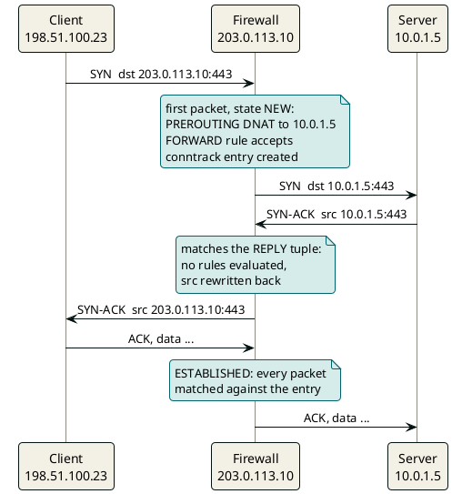

A stateful firewall makes **one decision per flow, not per packet**. The first packet is judged by your rules and your NAT table. That verdict, plus any address rewrite, gets frozen into a conntrack entry, and every later packet in either direction is matched against that entry instead of the rules.

That's the whole trick. Every weird firewall bug below is some violation of it.



## Stateless vs stateful, concretely

A stateless ACL (old routers, cloud network ACLs) sees each packet alone. To let replies back in, you must open "any source port 443 to my ephemeral ports 1024-65535", which is a giant hole.

A stateful firewall remembers "I saw 198.51.100.23:51544 open a connection to 443", so the reply is allowed because it belongs to a known flow, not because a rule matches it. Your ruleset collapses to:

```bash
iptables -P FORWARD DROP
iptables -A FORWARD -m conntrack --ctstate ESTABLISHED,RELATED -j ACCEPT
iptables -A FORWARD -m conntrack --ctstate INVALID -j DROP
iptables -A FORWARD -i wan0 -o dmz0 -d 10.0.1.5 -p tcp --dport 443 \
         -m conntrack --ctstate NEW -j ACCEPT
iptables -t nat -A PREROUTING -i wan0 -d 203.0.113.10 -p tcp --dport 443 \
         -j DNAT --to-destination 10.0.1.5:443
```

Note that the FORWARD rule matches `-d 10.0.1.5`, not the public IP. DNAT already ran in PREROUTING, before routing and filtering. Writing the filter rule against `203.0.113.10` is the most common "my DNAT doesn't work" bug.

## What a conntrack entry actually looks like

```text
tcp 6 431987 ESTABLISHED
  src=198.51.100.23 dst=203.0.113.10  sport=51544 dport=443     ← ORIGINAL tuple
  src=10.0.1.5      dst=198.51.100.23 sport=443   dport=51544   ← REPLY tuple
  [ASSURED] mark=0 use=1
```

| Field | Meaning |
|---|---|
| `431987` | seconds left before eviction (the TCP established default is 432000, 5 days) |
| ORIGINAL tuple | what the client sent |
| REPLY tuple | what the reply is expected to look like; NAT is encoded here |
| `ASSURED` | traffic seen both ways, so it is protected from early eviction |

The REPLY tuple is where DNAT lives. Its source is `10.0.1.5`, not `203.0.113.10`. When the server answers, the kernel matches the reply, sees it differs from the ORIGINAL tuple, and rewrites the source back to `203.0.113.10`. You never write an "un-DNAT" rule. It is implied by the entry.

## States

| State | When | Example |
|---|---|---|
| NEW | first packet, no entry | client SYN |
| ESTABLISHED | traffic seen both ways | everything after the SYN-ACK |
| RELATED | new flow tied to an existing one | ICMP "fragmentation needed" for this TCP flow; an FTP data channel |
| INVALID | doesn't fit any known flow | stray ACK, out-of-window segment |

Internally, TCP also tracks SYN_SENT, SYN_RECV, ESTABLISHED, FIN_WAIT and TIME_WAIT, each with its own timeout. UDP has no handshake, so its state is a guess: an unreplied flow lives 30 seconds, and once replies are seen it is treated as a stream and lives 120 seconds after the last packet.

Two caveats on RELATED:

- **Dropping RELATED ICMP is a classic silent killer.** Path MTU discovery breaks: small requests work, and large responses hang forever.
- **FTP data channels only become RELATED if the ftp helper is attached.** Modern kernels no longer assign helpers automatically, so you need an explicit `CT --helper ftp` rule.

## DNAT vs SNAT vs masquerade

| Type | Rewrites | Where | Use |
|---|---|---|---|
| DNAT | destination | PREROUTING | expose an internal server (inbound) |
| SNAT | source, to a fixed IP | POSTROUTING | internal hosts out to the internet |
| MASQUERADE | source, to the interface's current IP | POSTROUTING | home routers, dynamic IPs |
| PAT / NAPT | source IP and port | POSTROUTING | many hosts share one IP; the port tells them apart |

Your home router does PAT outbound, and your ISP probably does it again (carrier-grade NAT, from the 100.64.0.0/10 range). That double NAT is why you can't host anything from home without a tunnel.

## Failure modes, and the guards that didn't catch them

### Asymmetric routing

```text
SYN       client → FW-A (DNAT, entry created) → 10.0.1.5
SYN-ACK   10.0.1.5 → default gateway is FW-B  -X-  FW-B has no entry
          src stays 10.0.1.5, the client gets a reply from an unknown IP and drops it
```

Guards that missed it:

- **FW-A's rules were correct.** It only ever sees half the flow.
- **FW-B dropped the SYN-ACK as INVALID.** From the client's side, that looks like a timeout, not an error.

The fix is symmetric routing, or SNAT on the way in so replies have to come back through FW-A. SNAT costs you the real client IP, which is why proxies pass it along in `X-Forwarded-For`.

### The idle timeout kills long-lived connections

```text
t=0      Kafka consumer ↔ broker, entry ESTABLISHED through a cloud NAT / load balancer
t=4min   no packets; the load balancer's idle timeout evicts the entry
t=6min   broker sends a fetch response  -X-  no entry, dropped
         the app sees nothing until its own socket timeout, then a reconnect storm
```

Guards that missed it:

- **TCP keepalive.** The Linux default is 2 hours, far above the middlebox's idle timeout (4 minutes by default on an Azure load balancer, 350 seconds on an AWS NAT gateway).
- **Error reporting.** The side that is waiting never gets a RST, so no error fires.

The fix is a keepalive below the middlebox's idle timeout, or application-level heartbeats. This matters for any Kafka client or database pool that runs through cloud NAT.

### The table fills up

```text
dmesg: nf_conntrack: table full, dropping packet
```

Every flow costs an entry, including ones you'd never think about, like DNS lookups and health checks. Under a SYN flood or a chatty service mesh, `nf_conntrack_max` fills up, and new connections drop at random while existing ones keep working. Compare `conntrack -C` with `sysctl net.netfilter.nf_conntrack_max`.

## The Kubernetes connection

This isn't only perimeter-firewall territory. kube-proxy in iptables mode is exactly this machine. A ClusterIP like `10.96.0.42:80` exists on no interface. Every node has a nat rule that DNATs it to a randomly picked pod IP, and conntrack pins the flow to that pod. Consequences you may have seen:

- **Long-lived connections stick to one pod forever.** Scaling up doesn't rebalance them, and gRPC and Kafka clients notice.
- **The well-known "5 second DNS delay" was a conntrack race.** Two UDP packets from the same socket (the A and AAAA queries) raced to insert entries, one was dropped, and the resolver retried after 5 seconds.
- **UDP has no FIN, so a deleted pod's entries would keep pointing at a dead IP until they time out.** kube-proxy reconciles the table and deletes stale UDP entries itself. When that cleanup lags, or a different dataplane skips it, DNS to a replaced CoreDNS pod quietly black-holes.

## See it with your own eyes

On any Linux box with conntrack loaded (anything running Docker or NAT rules has it) and the `conntrack` tool installed:

```bash
sudo conntrack -L                                # dump the table
sudo conntrack -E                                # live stream of NEW / UPDATE / DESTROY events
sudo iptables -t nat -L -n -v --line-numbers     # packet counters on the DNAT rules
```

Run `conntrack -E` in one terminal and `curl https://example.com` in another. You'll watch the entry be born, go ESTABLISHED, then TIME_WAIT, then DESTROY. On a Kubernetes node, `iptables -t nat -L KUBE-SERVICES -n` shows the ClusterIP DNAT chains. That's the fastest way to make all of this stop being abstract.

## References

- [Netfilter conntrack sysctl defaults](https://docs.kernel.org/networking/nf_conntrack-sysctl.html), Linux kernel documentation
- [kube-proxy stale UDP conntrack cleanup](https://github.com/kubernetes/kubernetes/blob/master/pkg/proxy/conntrack/cleanup.go), Kubernetes source
- [Azure Load Balancer TCP reset and idle timeout](https://learn.microsoft.com/azure/load-balancer/load-balancer-tcp-reset)
